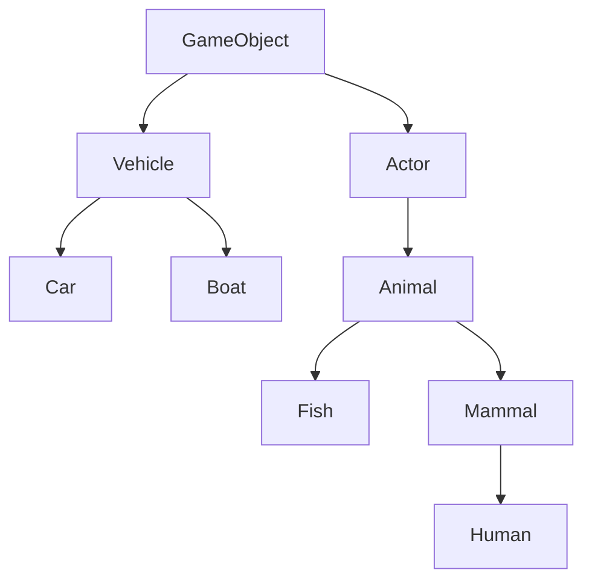

# Slides 5 - Inheritance

Inheritance allows us to reuse code and structure our code hierarchically.

## Inheritance in Real Life
In real life, the concept of inheritance describes how you inherit traits from your genetic parents.

## Inheriting Fields
In C#, Inheritance can be used to do the same:

### NPCs have Health

```csharp
public class NPC {
    public int Health;
}
```

### Every Mage is an NPC
```csharp
public class Mage : NPC {
    public int Mana;
}
```

### Therefore, Every Mage has Health

```csharp
Mage mage = new Mage();
mage.Health = 100;
```

### And they also have Mana
```csharp
Mage mage = new Mage();
mage.Mana = 12;
```

### Other NPCs have Health

```csharp
NPC npc = new NPC();
npc.Health = 100;
```

### But they don't have Mana

```csharp
NPC npc = new NPC();
npc.Mana = 12; // ERROR
```

## Inheriting Methods

The same as goes for Fields also goes for Methods:

```csharp
public class NPC {
    public int Health;
    public void TakeDamage() {
        Health--;
    }
}
```

```csharp
public class Mage : NPC {
    public int Mana;
    public void CastHealSpell() {
        if(Mana > 0) {
            Mana--;
            Health++;
        }
    }
}
```

## Inheritance All the Way?!
In the past, Games were made by creating huge Trees of Inheritance:



And then giving each of these classes the Methods and Fields they need:
- All GameObjects have a Position in the World
- Actors can move themselves
- Vehicles can be used by Actors to move
- Cars have specific steering mechanics
- Boats can ride on water
- Animals have certain NPC behaviours
- Humans can talk and walk
- Fish can swim and live underwater
- Mammals can carry babies

## The Limitations of Inheritance

Limitations of such systems:
- What would a dolphin inherit from?
  - Fish or Mammal?
- What would a horse inherit from?
  - Vehicle or Mammal?
- What would a pegasus inherit from?
  - Bird or Horse?

## Solution 1: Multiple Inheritance
Supported by C++, but inherits (pun intended) other problems (more on those later)

## Solution 2: Composition over Inheritance
Instead of inheriting Behaviour, we can Compose behaviours through Components. This is what we'll be doing in Unity!

Instead of:
- A Dolphin inherits from Fish

We do:
- A Dolphin has these components:
  - Animal (has certain NPC behaviours)
  - Fish (can swim and live underwater)
  - Mammal (can carry babies)
  - Dolphin (sings So long, and thanks for all the fish)

Instead of:
- A Horse inherits from Mammal

We do:
- A Horse has these components:
  - Animal (has certain NPC behaviours)
  - Mammal (can carry babies)
  - Vehicle (can be used for transportation)
  - Horse (attracts a cult of fans)

## Why Teach us Inheritance, Then?
Because in order to write even a single Component in Unity, we need to inherit from a Base Class, that has all basic logic for Components.